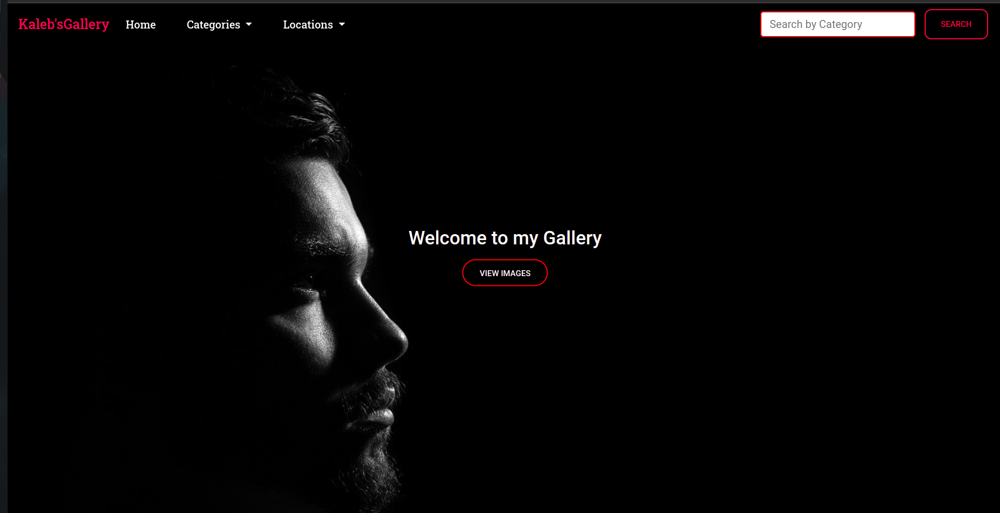
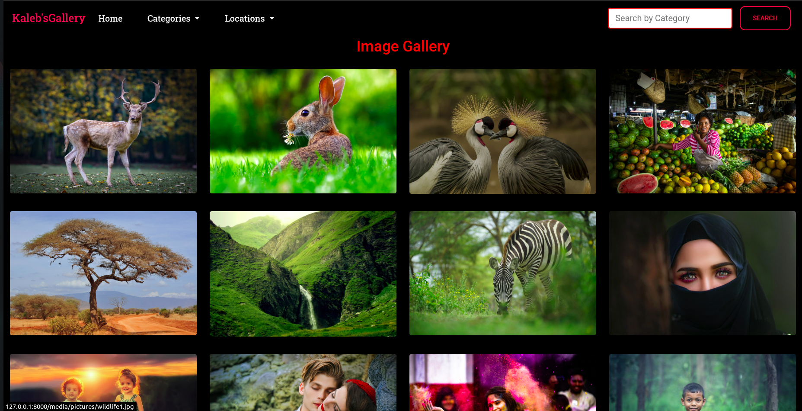
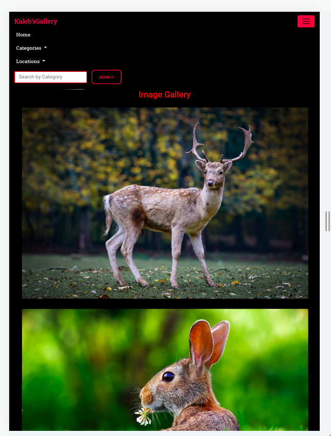

# Kaleb's Gallery

## Description

A personal gallery application to display various photos by categories and locations from around the world.
## Author

[CalebKabaya](https://github.com/CalebKabaya/)

### Screenshots

```
Landing Page
```



```
Mobile View
```



### User Stories
+ [x] View different photos that interest me.
+ [x] Click on a single photo to expand it and also view the details of the photo. The photo details must appear on a modal within the same route as the main page.
+ [x] Search for different categories of photos. (ie. People, Food)
+ [x] Copy a link to the photo to share with my friends.
+ [x] View photos based on the location they were taken.

### Technologies
* BackEnd:
      * Python
      * Django
* FontEnd:
      * HTML
      * CSS
      * JavaScript
      * Bootstrap
* Database
      * PostgreSQL
* Deployment
      * Heroku   

### BDD
| Input              | Output                     |
|---------------     |---------------             |
| Click on a photo   | Display images in Fancybox with details |
| Click copy Link button| Copy Link to Clipboard      |
| Search image in a certain category| View photos matching search term|

## Installation
### Requirements

* Either a computer,phone,tablet or an Ipad
* An access to the Internet


### Installation
To get the code..

1. Cloning the repository:
  ```bash
  git clone https://github.com/CalebKabaya/my-gallery
  ```
2. Move to the folder and install requirements
  ```bash
  cd my_gallery
  pipenv install <package name>
  ```
3. Running the application

  ```bash
  make
  ```
4. Testing the application
  ```bash
  python3.8 manage.py test
  ```
Open the application on your browser `127.0.0.1:8000`.
### Known bugs
No known bugs

## Contact Information

For any further inquiries or contributions or comments, reach me at 
### License

## Licence

[MIT](license)

Copyright (c) 2021
